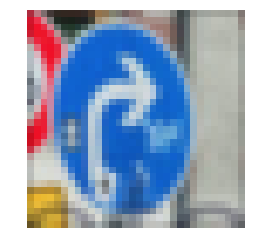

# Traffic Sign Recognition

In this project I use convolution neural network to build a classifier for the traffic signs. The pipeline includes:

1. Load the data set (train, validation and test).
2. Preprocessing the images.
3. Training and validation.
4. Use the model to make predictions on new images.

## Data Set Summary and Exploration

### 1. Provide a Writeup / README that includes all the rubric points and how you addressed each one. You can submit your writeup as markdown or pdf. You can use this template as a guide for writing the report. The submission includes the project code.

In total there are 51839 images. The dataset has been split into three parts: train (34799), validation (4410) and test (12630) datasets. There are 43 unique labels in this dataset. And all images have been resized to 32x32 pixels with RGB channels.

I conducted two exploration on the dataset. The first step is to visualize and compare the label distributions between train, validation and test dataset.

This is a comparison of distributions of labels between train and test sets:


The distributions between train and test dataset are close to each other. And the label with the smallest number in the training set has 180 images. And the label with label with largest number in the training set has 2010 images. Since there is no label with too small number of images, I decided not to adjust the imbalance of distribution of labels.

The second step is to sample 5 images from each label to visually check some images. This can help us the conditions of these images such as color, viewing angle and lightness. And based on that we can think of ways to augment the dataset.


I found that the traffic signs images varied in their color, brightness, zoom, and blurriness. There are also difference in the rotation angle. All of these should be considered as preprocessing during the data augmentation.

## Design and Test a Model Architecture

### 1. Describe how you preprocessed the image data. What techniques were chosen and why did you choose these techniques? Consider including images showing the output of each preprocessing technique. Pre-processing refers to techniques such as converting to grayscale, normalization, etc. (OPTIONAL: As described in the "Stand Out Suggestions" part of the rubric, if you generated additional data for training, describe why you decided to generate additional data, how you generated the data, and provide example images of the additional data. Then describe the characteristics of the augmented training set like number of images in the set, number of images for each class, etc.)

I conducted both normalization and augmentation of the original dataset.
I normalize each image using the global mean and standard deviations from the training dataset. To feed data into PyTorch pipelines, I scaled data points into $[0, 1]$.

Based on the visual check in the previous part, I conducted the following operations for augmentations (using the [Fastai](https://github.com/fastai/fastai) library):

* adjust the lighting and color
* add blurriness
* add rotation and zoom
* add padding

The source code for conducting the augmentation is 

```python
augs = [
    RandomLighting(0.05, 0.3),
    RandomBlur(3),
    RandomRotateZoom(20, 0.1, 0.2, ps=[0.25, 0.3, 0.3, 0.15]),
    AddPadding(5)
]
```

Some sample results after augmentation:


After augmentation the dataset becomes much more diverse in terms of the light condition, rotation and clearness. Since the original dataset has a small number of observations, this should help improve the performance of my prediction models.

### 2. Describe what your final model architecture looks like including model type, layers, layer sizes, connectivity, etc.) Consider including a diagram and/or table describing the final model.

I tried two models: LeNet and ResNet18. My final model is RetNet18 and the architecture is in the '18-layer' column of the table from the original paper[1]:


ResNet18 has 4 residual blocks. Each residual block consists of several 'basic blocks'. In the case of ResNet18, they are simply two convolutional layers. ResNet make use of shortcut connections to help training.
There is an identity connection between the basic blocks in the same residual block. And between two residual block there is a projection connection (projecting the input to the same dimension of the input of the next residual block).

### 3. Describe how you trained your model. The discussion can include the type of optimizer, the batch size, number of epochs and any hyperparameters such as learning rate.

I use Adam as the optimizer. The batch size is 256. Number of epochs is 50. I used the multi-stages for the learning rate. The learning rate at each stage is

1. Epoch 0 to 30: 5e-4 
2. Epoch 30 to 50: 5e-5

The multi-stage scheduling of learning rates significantly improves the training process. It improves the validation accuracy of 98.571% to the 99.297%.

### 4. Describe the approach taken for finding a solution and getting the validation set accuracy to be at least 0.93. Include in the discussion the results on the training, validation and test sets and where in the code these were calculated. Your approach may have been an iterative process, in which case, outline the steps you took to get to the final solution and why you chose those steps. Perhaps your solution involved an already well known implementation or architecture. In this case, discuss why you think the architecture is suitable for the current problem.

My initial model is LeNet with a test accuracy of 95.154%. One reason it is difficult to further improve the result might be the small capacity of the model as the model only consists of two convolutional layers.

My final choice is the ResNet18 as it introduces the residual learning to help training. It has been empirically proved to be more effective than previous architectures in many computer vision tasks.

I chose the ResNet18 because the size of the dataset is small and the 18-layer version in the original paper should be sufficient to solve this problem.

My final model works well in the traffic sign application. My final model results are

* training accuracy:  99.971%
* validation accuracy: 99.184%
* test accuracy: 99.184%

## Test a Model on New Images

### 1.Choose five German traffic signs found on the web and provide them in the report. For each image, discuss what quality or qualities might be difficult to classify

Here are eight German traffic signs that I found on the web:

   
   
 

The third image is more difficult as the snow cover about half of the size.

### 2. Discuss the model's predictions on these new traffic signs and compare the results to predicting on the test set. At a minimum, discuss what the predictions were, the accuracy on these new predictions, and compare the accuracy to the accuracy on the test set (OPTIONAL: Discuss the results in more detail as described in the "Stand Out Suggestions" part of the rubric).

Here are the results of the prediction:

| Image                 |                  Prediction                   |   Probabilities    |
|:---------------------:|:---------------------------------------------:|:------------------:|
| No vehicles           | No vehicles                                   |   0.9560           | 
| Road work             | Road work                                     |   0.9992           |
| Road work             | Road work                                     |   0.9688           |
| Bicycle crossing      | Bicycle crossing                              |   0.9914           |
| Turn right ahead      | Turn right ahead                              |   0.9769           |
| Double curve          | Double curve                                  |   0.9944           |
| Wild animal crossing  | Wild animal crossing                          |   0.9991           |
| No passing            | No passing                                    |   0.9991           |

The accuracy is 100%. The model correctly classifies these 8 samples, including the third one covered by snow.

#### 3. Describe how certain the model is when predicting on each of the five new images by looking at the softmax probabilities for each prediction. Provide the top 5 softmax probabilities for each image along with the sign type of each probability. (OPTIONAL: as described in the "Stand Out Suggestions" part of the rubric, visualizations can also be provided such as bar charts)

The table above lists the probabilities for the top 1 prediction of the model. The softmax probabilities are calculated by applying the softmax function to the raw scores and normalize over 43 labels. We find the model not only predicts the correct labels for all eight images. It also shows high confidence for the top 1 prediction.

The top 5 predictions are

```python
['No vehicles', 'Yield', 'Ahead only', 'Speed limit (70km/h)', 'End of all speed and passing limits']
['Road work', 'No passing for vehicles over 3.5 metric tons', 'Stop', 'Go straight or right', 'Speed limit (30km/h)']
['Road work', 'Traffic signals', 'Priority road', 'Speed limit (120km/h)', 'Slippery road']
['Bicycles crossing', 'No vehicles', 'Speed limit (50km/h)', 'Bumpy road', 'Children crossing']
['Turn right ahead', 'Go straight or right', 'Speed limit (60km/h)', 'Ahead only', 'Yield']
['Double curve', 'Speed limit (50km/h)', 'Wild animals crossing', 'Slippery road', 'Bicycles crossing']
['Wild animals crossing', 'Double curve', 'Bicycles crossing', 'End of speed limit (80km/h)', 'No passing for vehicles over 3.5 metric tons']
['No passing', 'Speed limit (120km/h)', 'End of no passing', 'Speed limit (60km/h)', 'General caution']
```

And the probabilities for top 5 predictions are 

```python
[0.95601 0.00846 0.00806 0.00245 0.00215]
[0.99915 0.00007 0.00006 0.00005 0.00005]
[0.96878 0.00617 0.00412 0.00227 0.00203]
[0.99142 0.00105 0.00099 0.00087 0.00085]
[0.97686 0.00366 0.00326 0.00231 0.00116]
[0.9944  0.00078 0.00076 0.00053 0.00036]
[0.9991  0.00011 0.00011 0.00008 0.00007]
[0.99913 0.00006 0.00006 0.00006 0.00006]
```

## (Optional) Visualizing the Neural Network (See Step 4 of the IPython notebook for more details)

### 1. Discuss the visual output of your trained network's feature maps. What characteristics did the neural network use to make classifications?

This is the original image:


I visualized the two activations layers for LeNet.
The feature maps of the first convolutional layer is 


The feature maps of the second convolutional layer are


The first convolutional layer is like an edge detector where the most relevant information are reserved in the feature maps. And the feature maps in the second layer learns more specific parts of the objects: some focus more on the inner part of the sign, while some feature maps focus more on the outer ring of the sign. This is consistent with the idea that deeper layers learn more abstract features and carry less specific information.

## Reference

1. He, Kaiming, et al. "Deep residual learning for image recognition." Proceedings of the IEEE conference on computer vision and pattern recognition. 2016.
